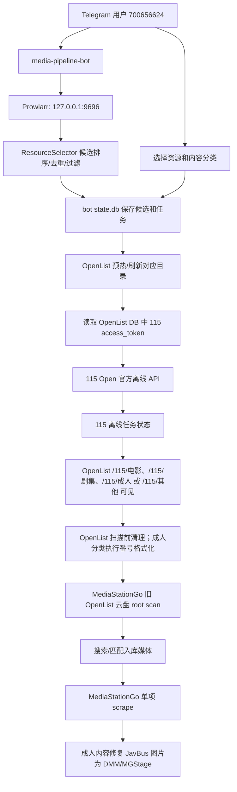

# Media Pipeline 项目设计与当前进度

记录时间：2026-07-04  
远端目录：`/opt/media-pipeline`  
部署主机：`usa4c4g-1`  
本文状态：按 2026-07-03 对服务端实际运行状态重新核验并整理。

本文只记录架构、链路、配置位置、运行状态和已知问题，不记录任何 OpenList token、Telegram bot token、Prowlarr API key、115 access token、MediaStationGo 管理员密码等敏感明文。

## 1. 主线目标

目标流水线：

```text
Telegram Bot 收到影片名或磁链
-> 搜索影片资源
-> 返回候选并由用户选择资源
-> 用户手动选择内容分类：电影 / 剧集 / 成人 / 其他
-> 使用 115 官方开放接口创建离线任务
-> 查询/等待 115 离线完成
-> OpenList 可见 115 文件
-> 触发 MediaStationGo 扫描旧 OpenList 云盘媒体库 root
-> 触发 MediaStationGo 单项刮削
-> 成人内容检查并修复不可直连的 JavBus 图片
```

当前服务端实际进度：

```text
Telegram Bot 搜索/候选分页/资源选择
-> 手动内容分类选择
-> 115 官方离线提交
-> 115 任务状态反馈
-> OpenList 刷新与可见性验证
-> OpenList 清理/成人番号格式化
-> MediaStationGo 登录
-> MediaStationGo 旧 OpenList 云盘 root scan
-> 等待媒体出现
-> MediaStationGo scrape_media
-> 成人图片修复
```

结论：MediaStationGo 已经接入 Bot 主线。当前使用 OpenList 云盘媒体库 root 扫描方案，MSG 保留 `电影`、`剧集`、`成人`、`其他媒体` 四个 pipeline active root；Bot 侧分类仍由用户手动选择。成人内容在 MSG 单项刮削后会执行图片修复，避免 JavBus 图片 403 导致封面无法加载。Bot 的 `其他` 分类在 MSG 中显示为 `其他媒体`，按普通 movie 类型处理，用于承接不适合继续留在成人库的 no_match 内容。

## 2. 总体架构



## 3. 服务端部署状态

当前相关容器：

```text
media-pipeline-bot                 Up, RestartCount=0
prowlarr                           Up, 127.0.0.1:9696
openlist                           Up, 127.0.0.1:5244
mediastationgo-mediastation-go-1    Up healthy, 127.0.0.1:18080->8080
mediastationgo-postgres-1           Up healthy
```

`/opt/media-pipeline/docker-compose.yml` 当前包含两个 service：

- `media-pipeline`：一次性 CLI service，默认命令 `folders`。
- `media-pipeline-bot`：常驻 Bot service，`restart: unless-stopped`。

当前生产交互以 `media-pipeline-bot` 为准；CLI 不再作为维护目标，不再追平 Bot 能力。Bot service 已配置以下环境变量类别：

```text
MEDIA_PIPELINE_VERSION / MEDIA_PIPELINE_REVISION
OPENLIST_TOKEN
TG_BOT_TOKEN
TG_ALLOWED_USER_IDS=700656624
BOT_STATE_DB=/bot-data/state.db
MSG_BASE_URL
MSG_ADMIN_USER
MSG_ADMIN_PASSWORD
MSG_ENABLED
MSG_SYNC_POLL_SECONDS
MSG_SYNC_POLL_INTERVAL_SECONDS
OPENLIST_PRE_SCAN_CLEAN_ENABLED
OPENLIST_PRE_SCAN_CLEAN_MAX_BYTES
OPENLIST_ADULT_CODE_FORMAT_ENABLED
BOT_SEARCH_LIMIT / TG_API_TIMEOUT / BOT_SYNC_RECOVERY_INTERVAL_SECONDS
OPENLIST_DB / OPENLIST_URL
PROWLARR_URL / PROWLARR_CONFIG
```

这些值来自远端 `/opt/media-pipeline/.env` 或 compose 默认插值；`docker-compose.yml` 只保留变量引用。文档只记录变量存在，不记录任何 token/key/password。

当前版本可通过 Bot 发送 `/version` 查看，返回 `media-pipeline <version>` 和 `revision`。

## 4. Prowlarr

- 容器：`prowlarr`
- API：`127.0.0.1:9696`
- 配置目录：`/data/Prowlarr/config`
- API key 来源：`/data/Prowlarr/config/config.xml`
- 当前 health：`0` 个健康问题。

当前启用 indexer：

```text
ACG.RIP
Bangumi Moe
Knaben
LimeTorrents
MagnetDownload
Mikan
Nyaa.si
sukebei.nyaa.si
The Pirate Bay
TorrentProject2
YTS
```

当前未启用或创建失败的方向：

- `52BT`
- `1337x`
- `0Magnet`
- `EZTV`
- `Anidex`
- `TorrentKitty`

原因：当前服务器路径访问时命中 Cloudflare、镜像不可用或请求超时。`0Magnet` 已在 2026-07-04 因 `相泽南` 搜索拖慢/超时被禁用；后续如必须使用，需要 FlareSolverr、可用镜像或私有 indexer。

2026-07-04 已通过 Prowlarr schema 只读确认 `1337x` 可添加，但 `1337x.to`、`1337x.st`、`x1337x.ws`、`x1337x.eu`、`x1337x.cc` 均未通过 Prowlarr test，返回 Cloudflare Protection 拦截；未强制保存该 indexer。

## 5. OpenList 与 115 目录

OpenList：

- 容器：`openlist`
- API：`127.0.0.1:5244`
- 公网反代：`https://prioplist.timefunnel.top`
- 数据目录：`/data/OpenList/data`
- 当前 115 Open 存储：
  - `id=1`
  - `driver=115 Open`
  - `mount_path=/115`
  - `disabled=0`

OpenList 路径：

```text
movie -> /115/电影
tv -> /115/剧集
adult -> /115/成人
other -> /115/其他
```

115 目录：

```text
movie -> 3464134653584082023
tv -> 3465137076394001831
adult -> 3464134590896014943
other -> 3465205291639899794
```

当前 `verify-folders` 核验结果：

```text
movie folder code=0 count=6
tv folder code=0 count=2
adult folder code=0 count=87
other folder code=0 count=15
```

当前 `probe` 核验结果：

```text
storage_id=1
mount_path=/115
quota code=0 used=69 count=1500
offline task list code=0 count=97 page_count=4
```

重要运行细节：

- pipeline 不主动刷新 115 refresh token。
- pipeline 从 OpenList SQLite 只读读取 115 access token。
- OpenList 负责维护 115 Open token。
- `https://prioplist.timefunnel.top/d/...` 已验证可用，但当前不作为默认播放入口。2026-07-03 对比同一 CJ7 样本：公网 OpenList `/d` 三轮平均约 1.0s；MSG cloud play 命中缓存后三轮约 2ms 到 115 CDN。因此当前保留 MSG cloud play，公网反代作为备用对照入口。
- Bot 调 115 接口时，如果遇到 `access_token 无效/过期/失效`，会触发 OpenList `refresh=True` 后重试。
- CLI 的 `probe/verify-folders/task-status` 当前主要是普通 OpenList warm；如果刚好读到过期 115 access token，可能先报 `access_token 无效`。手动触发 OpenList `refresh=True` 后复查已恢复正常。

手动触发 OpenList refresh 的核验命令：

```bash
cd /opt/media-pipeline
docker exec media-pipeline-bot python -c 'from pipeline.openlist import OpenListClient,OpenListTokenProvider; OpenListClient("http://127.0.0.1:5244", OpenListTokenProvider().load_token()).list_path("/115/电影", refresh=True); print("openlist_refresh_ok")'
```

## 6. MediaStationGo

容器：

- `mediastationgo-mediastation-go-1`
- `mediastationgo-postgres-1`

端口：

- HTTP：`127.0.0.1:18080 -> 8080`
- PostgreSQL：容器内 `5432`

当前 API 状态：

```text
/api/health -> HTTP 200
msg-login -> {"authenticated": true}
```

当前 MSG 镜像状态：

```text
image: ghcr.io/shukebta/mediastation-go:latest
digest: sha256:8c7111f400288a119d9b426dca6ce7fdeb761254f19a1c670aee136376c0faf8
updated_at: 2026-07-03 22:52 Asia/Shanghai
pre-upgrade backup: /opt/media-pipeline/backups/msg-upgrade-20260703225139
```

当前数据库摘要：

```text
active cloud://openlist media: 268
MSG guard trigger: pipeline_guard_msg_cloud_media
```

当前 pipeline 使用的 MediaStationGo 云盘媒体库：

```text
26768071-73bb-4b5c-85f3-ad0dd84f9fd9 | 成人 | adult | cloud://openlist/115%2F%E6%88%90%E4%BA%BA
d150a96c-b467-4c60-82f1-207ae5949045 | 电影 | movie | cloud://openlist/115%2F%E7%94%B5%E5%BD%B1
b6c58f40-76dc-46b5-8f27-9e74d22e5e3d | 剧集 | tv | cloud://openlist/115%2F%E5%89%A7%E9%9B%86
60067bc7-eb34-466c-8bf9-5654297a609f | 其他媒体 | movie | cloud://openlist/115%2F%E5%85%B6%E4%BB%96
```

说明：

- 历史自动分类库和临时测试库已从 MSG `libraries/library_roots` 中物理清理；未删除 115/OpenList 文件。
- MSG `/libraries` 当前只应看到 `成人`、`电影`、`剧集`、`其他媒体` 四个 pipeline active 库。
- Bot 的 `其他` 分类在 MSG 中显示为 `其他媒体`，当前按 MSG `movie` 类型处理；不加入 `adult.library_ids`，不执行成人番号格式化和成人图片修复。
- 2026-07-04 已将成人库中 `scrape_status=no_match` 或确认无法刮削的存量内容迁移到 `其他媒体`：OpenList `/115/其他` 当前 15 个目录，MSG `其他媒体` 当前 24 条 no_match 媒体；成人库 no_match 当前为 0。

当前 OpenList 云盘 root 映射：

```text
movie:
  library_id=d150a96c-b467-4c60-82f1-207ae5949045
  root_id=0c1dda42-29ef-4069-b051-c9549a8d4440
  provider=tmdb
  media_type=movie

tv:
  library_id=b6c58f40-76dc-46b5-8f27-9e74d22e5e3d
  root_id=3d2e0cb4-3537-4f7d-8d79-9d4d5f1800df
  provider=tmdb
  media_type=tv

adult:
  library_id=26768071-73bb-4b5c-85f3-ad0dd84f9fd9
  root_id=3fe479e8-4a96-4e61-9f69-fa802e448446
  provider=adult
  media_type=adult

other:
  library_id=60067bc7-eb34-466c-8bf9-5654297a609f
  root_id=1f889ec1-b34d-40b6-b3ca-f4372170a42b
  provider=tmdb
  media_type=movie
```

关键设置：

```text
scrape.auto_on_scan=false
cloud.auto_sync_enabled=false
cloud.boot_scan_enabled=false
```

`scrape.auto_on_scan` 已关闭。当前流水线由 bot 在扫描后显式执行单项 `scrape_media`，不依赖 MSG 全局自动刮削。

当前接入方式：

- 常规同步通过 MediaStationGo API 登录、扫描和刮削；不由 Bot 直接写 MSG 数据库。
- 115 任务完成后，Bot 直接扫描旧 OpenList 云盘 root：电影任务扫描电影库，剧集任务扫描剧集库，成人任务扫描成人库，其他任务扫描其他库。
- scan 后通过标题、file_id、番号等查询 MediaStationGo 媒体。
- 找到媒体后调用单项 `scrape_media`。
- 成人内容单项刮削后，Bot 会读取媒体元数据，识别 `javbus/cdnbus/javsee/busjav` 图片 URL，并用实际可访问的 DMM/MGStage 候选替换 `poster_url/backdrop_url`。
- `其他` 内容按 movie 类型走普通单项刮削，不执行成人图片修复。
- MSG 数据库触发器 `pipeline_guard_msg_cloud_media` 保护当前四个云盘库的 `library_id/library_root_id/path/relative_path/file_id`，避免刮削把媒体重新分类或挪到其他 root。
- 触发器不拦截标题、简介、海报、评分、年份、外部 ID、`scrape_status` 等元数据更新。
- 如果 API 返回认证或扫描错误，Bot 记录失败状态，不伪装成功。

### 6.1 成人元数据源与图片修复

当前 MSG 成人 API 配置：

```text
provider=adult
base_url=https://javdb.com
extra=
description=Adult / 番号元数据（JavDB 优先；当前 MSG 内置默认源仍可能回退 JavBus）
```

重要限制：

- 当前 MSG 代码只有 JavDB/JavBus 两类成人刮削实现，没有真正的 JavLibrary 刮削器。
- `javlibrary.com` 配到 MSG 时会被当作 JavDB 风格 URL 使用，不能作为可靠 JavLibrary 源。
- MSG 内部 `resolveBases` 会追加默认成人源；即使配置 JavDB 优先，当 JavDB 403、超时或无匹配时仍可能回退到 JavBus。
- 2026-07-04 从 `media-pipeline-bot` 容器实测，JavDB/JavLibrary 搜索请求返回 403，因此当前不能稳定“只靠 JavDB/JavLibrary 重刮”。

当前实际处理：

- Bot 在成人单项刮削后执行 `repair_adult_artwork`。
- 如果海报或背景图来自 JavBus 相关域名，先从已有 MGStage sample 图推导 `pf_o1` 封面；无法推导时按番号生成 DMM 图片候选。
- DMM 候选必须在 Bot 容器内实际返回 `2xx image/*`，并且最终重定向 URL 不包含 `now_printing`，才会写入 MSG `PATCH /media/{id}/metadata`。
- DMM 的部分不存在图片会返回 `200 image/jpeg` 但跳转到 `now_printing` 占位图，不能仅用 HTTP 200 判断图片有效。
- 找不到可直连替代图源时，任务状态会显示“成人图片修复：未完成（未找到可直连替代图源）”，不会伪装成功。
- 2026-07-04 已将成人库现存 JavBus 图片修复为 DMM/MGStage；修复后成人库 `poster_url/backdrop_url` 中 JavBus 相关域名计数为 `0/0`。
- 2026-07-04 已复查成人库全部 DMM 图片字段，`now_printing` 占位重定向计数为 `0`；无真实替代图的字段已清空。

## 7. Telegram Bot

服务：`media-pipeline-bot`

当前配置：

- 允许用户：`700656624`
- 状态库：`/data/media-pipeline/bot/state.db`
- 容器内状态库路径：`/bot-data/state.db`
- token 维护方式：远端 `/opt/media-pipeline/.env`，由 compose 变量插值注入容器环境。

当前交互能力：

```text
发送影片名/关键词/番号 -> 搜索资源
发送 magnet            -> 不搜索，直接进入内容分类选择
/help                  -> 查看当前功能入口
/tasks                 -> 查看最近任务
/status <info_hash>    -> 查询任务状态
/dedupe_refresh        -> 刷新已入库记录；先显示风险提示，二次确认后才执行
/version               -> 查看当前 media-pipeline 版本和 revision
未知 / 命令             -> 不作为搜索入口，提示直接发送关键词或磁链
点击候选分页按钮       -> 翻页，不重新搜索
点击关闭本页           -> 删除当前搜索结果消息
点击资源               -> 选择资源，另发内容分类选择消息，原资源列表保留
点击内容分类           -> 电影提交到电影 115 目录；剧集提交到剧集 115 目录；成人提交到成人 115 目录；其他提交到其他 115 目录
点击返回选种           -> 关闭当前内容分类选择消息，回到保留的资源列表继续选择
点击仍然入库           -> 弱重复提示后确认继续提交 115
点击刷新状态           -> 查询 115 状态；完成后尝试同步 MediaStationGo
点击重试MSG同步        -> 从失败阶段恢复 MediaStationGo 同步
点击取消               -> 取消活动中的 115 任务，不删除已产生文件
```

设计点：

- 搜索阶段使用 Prowlarr 聚合，不按普通/成人模式拆开搜索源。
- 搜索请求按关键词类型分流：普通关键词只查通用源；番号会额外补查 `sukebei.nyaa.si`；疑似动漫关键词才额外补查 Nyaa/ACG/Mikan/Bangumi 等动漫源。
- 搜索结果先选择资源，再手动选择内容分类；选择资源时不编辑/删除原搜索结果消息，方便同一批候选中连续入库多个资源。
- 当前内容分类固定为四类：电影、剧集、成人、其他。
- 电影分类走 115 电影目录和 MSG 电影云盘库；剧集分类走 115 剧集目录和 MSG 剧集云盘库；成人分类走 115 成人目录和 MSG 成人云盘库；其他分类走 115 其他目录和 MSG 其他媒体云盘库。
- callback 中只保存候选 id，不携带完整 magnet，避免 Telegram callback 64 字节限制。
- 点击入库后使用保存的 magnet，不重新搜索，避免排序漂移。
- 未授权用户直接拒绝。
- 搜索无可用资源时回复“未找到可用资源”。
- 115 提交后立即查询当前任务状态并反馈。
- 115 提交前会先做重复作品检测，强重复拦截，弱重复需要用户确认“仍然入库”。
- `/dedupe_refresh` 会手动刷新 `/115/电影`、`/115/剧集`、`/115/成人` 和 `/115/其他` 的 OpenList 基线索引，写入 Bot 本地状态库。
- 任务成功后可进入 MediaStationGo 同步阶段。
- MediaStationGo 同步失败后，状态消息和 `/tasks` 会提供“重试MSG同步”按钮。
- `/tasks` 会优先展示可重试、进行中、失败/取消任务；列表分页展示，并在每条任务中显示入库库类型、当前状态、进度、内容分类和 MSG 同步状态。
- Bot 启动后会定期检查 `msg_sync_status=running` 的成功离线任务，避免只依赖用户手动刷新。

### 7.1 重复作品识别

重复检测发生在 Bot 用户点击内容分类之后、调用 115 官方离线接口之前。

当前实际入口是内容分类按钮；重复检测仍按 115 大类执行：

- `movie` 内容分类按电影库查重。
- `tv` 内容分类按剧集库查重。
- `adult` 内容分类按成人库查重。
- `other` 内容分类按其他库查重。

当前分层：

```text
强重复:
  - Bot 状态库已有相同 info_hash。
  - 成人库已有相同标准番号或 FC2 番号。
  - OpenList 基线索引中已有相同成人番号。
  - MediaStationGo 成人库已存在相同番号媒体。

弱重复:
  - OpenList 基线索引中已有相同规范化标题。
  - MediaStationGo 电影库或剧集库搜索到标题相似媒体。
```

OpenList 基线索引：

- 表名：`dedupe_index`。
- 来源：Bot 命令 `/dedupe_refresh` 触发一次 OpenList refresh，并递归读取 `/115/电影`、`/115/剧集`、`/115/成人` 与 `/115/其他` 当前内容。
- 写入方式：刷新时先清理 `source=openlist` 的旧索引，再写入最新索引。
- 索引范围：按作品维度生成；库根下的目录视为一个作品，库根下散落的视频文件视为一个作品，图片、字幕、nfo、小样片等不作为独立作品索引。
- 索引类型：`normalized_title`、`adult_code`、`info_hash`（如果 OpenList item 暴露）。OpenList path 仅作为展示字段，不再作为身份行写入。
- 成人目录如果目录名缺少番号，会读取目录内文件名补充 `adult_code` 身份，但不会把目录内每个文件都当作品生成标题索引。
- 提交前查重只查本地 `dedupe_index`，不会为了每次提交实时刷新 OpenList，也不会增加 115 调用频率。

处理规则：

- 强重复：不提交 115，提示“重复入库拦截”，并提供“查看已有任务”入口（如果已有任务来自 Bot 状态库）。
- 弱重复：不立即提交 115，提示“可能重复入库”，展示来源、已有作品、媒体 ID 或 OpenList 路径；用户确认后可点击“仍然入库”继续提交。
- `force_submit` 只跳过当前候选的重复确认，不改变后续 115、OpenList、MediaStationGo 链路。
- 相同 `info_hash` 不提供“仍然入库”，避免完全重复下载。
- 普通影视不做仅凭标题的强拦截，避免误杀不同版本、重制版或同名作品。

## 8. 资源选择策略

当前规则：

- 只接受：
  - `magnet:` URL
  - 或可用 `infoHash` 构造的 magnet
- 拒绝 Prowlarr 本地代理下载链接，例如 `http://127.0.0.1:9696/...download?apikey=...`，除非有 `infoHash` 可构造 magnet。
- 不按 reported size 过滤资源。
- 普通 BT 源仍以 seeders 为主要排序权重。
- sukebei 等成人源有额外加分规则，允许保留部分 0 seed 候选。
- Knaben、MagnetDownload、TorrentProject、TorrentKitty、0Magnet、1337x、The Pirate Bay 等 DHT/聚合源的 0 seed 候选保留但降权，避免因 seeders 数据不准漏掉中文资源。
- Bot 点名补查单个 indexer 时会尊重 Prowlarr 的 `enable=false`，避免禁用源仍被请求。
- Prowlarr 主聚合搜索失败时，会按主 indexer 单站点降级重试；单个站点超时只记录失败，不再拖垮整次搜索。如果所有主站点都失败，则显式报错。
- CAM/TS/TC/SCR/SAMPLE 等标题降权。
- 对 2160p/4K、1080p、720p 加质量分。
- 支持同一 info_hash 去重。
- 支持中文字幕、无码等关键词加分。
- 分页展示候选。
- rank 超出当前候选范围时报错，不回退到 rank1。

## 9. 115 官方离线

当前使用 115 Open 官方接口：

- 添加离线任务：`https://proapi.115.com/open/offline/add_task_urls`
- 查询任务列表：`https://proapi.115.com/open/offline/get_task_list`
- 查询离线配额：`https://proapi.115.com/open/offline/get_quota_info`
- 查询目录：`https://proapi.115.com/open/folder/get_info`
- 取消任务：使用 115 官方离线任务删除接口，固定不删除已产生文件。

当前策略：

- 电影内容保存到 `3464134653584082023`。
- 剧集内容保存到 `3465137076394001831`。
- 成人内容保存到 `3464134590896014943`。
- 其他内容保存到 `3465205291639899794`。
- 真实提交必须由 CLI `--commit` 或用户点击 Bot 入库按钮触发。
- dry-run 不创建 115 任务。
- 不做失败后自动切换其他 rank。
- Bot 提交后会进入后台 115 状态轮询：
  - 任务提交后的 20 秒为快速观察期，每 2 秒查询一次并同步更新 Telegram 状态消息。
  - 快速观察期内的查询不累计到长期查询次数。
  - 20 秒后按常规间隔轮询；累计查询 10 次仍未完成时，轮询间隔降为 600 秒。
  - 任务超过 7200 秒仍未完成时自动取消 115 离线任务，并向 Bot 推送取消通知。

## 10. OpenList 扫描前处理

Bot 在 MediaStationGo 同步前会先刷新 OpenList，并可执行两个前处理动作。前处理完成后进入 MediaStationGo 云盘 root 扫描阶段。

### 10.1 扫描前清理

环境变量：

```text
OPENLIST_PRE_SCAN_CLEAN_ENABLED
OPENLIST_PRE_SCAN_CLEAN_MAX_BYTES
```

当前默认：

```text
enabled=true
max_bytes=20971520
```

用途：

- 在目标 OpenList 路径下定位本次离线产物。
- 尝试清理会干扰 MediaStationGo 扫描的小文件或无效项，默认启用。
- 字幕文件保留。
- 明确命名为广告、样片、预告等的视频文件删除，即使超过默认大小阈值也不保留。
- 能识别为分集正片的视频文件保留，例如 `第42集`、`第1话`、`S01E01`、`EP01`、`01.mp4`、`001.mkv`。
- 其他视频文件小于 `OPENLIST_PRE_SCAN_CLEAN_MAX_BYTES` 时删除，默认阈值为 20MB。
- 非视频、非字幕文件删除。
- 清理失败会记录状态；已观察到部分任务即使清理失败，后续 MediaStationGo scan/scrape 仍可成功。

### 10.2 成人番号格式化

环境变量：

```text
OPENLIST_ADULT_CODE_FORMAT_ENABLED
```

用途：

- 成人任务在 MediaStationGo scan 前尝试提取番号。
- 如果 OpenList 目标文件名缺少标准番号前缀，则尝试重命名。
- 如果已符合格式、找不到目标或找不到番号，则跳过并记录原因。
- 格式化失败会记录错误，不隐藏问题。

### 10.3 MSG 云盘 root 入库

处理规则：

- 根据任务中的 `content_profile` 决定 115 保存目录和 MSG 云盘 root。
- `movie` 扫描 MSG 电影云盘 root：`cloud://openlist/115%2F%E7%94%B5%E5%BD%B1`。
- `tv` 扫描 MSG 剧集云盘 root：`cloud://openlist/115%2F%E5%89%A7%E9%9B%86`。
- `adult` 扫描 MSG 成人云盘 root：`cloud://openlist/115%2F%E6%88%90%E4%BA%BA`。
- `other` 扫描 MSG 其他媒体云盘 root：`cloud://openlist/115%2F%E5%85%B6%E4%BB%96`，MSG 类型为 `movie`。
- Bot 触发 root scan 后等待媒体出现，再执行单项 `scrape_media`。
- 找不到 OpenList 目标、没有可识别媒体、MSG root scan 失败都会显式失败并记录到任务状态。

## 11. 当前任务状态快照

Bot 状态库：

```text
/data/media-pipeline/bot/state.db
container: /bot-data/state.db
tables: candidates, search_sessions, offline_tasks, dedupe_index, sqlite_sequence
offline_tasks count: 37
dedupe_index count: 143
dedupe_index category: adult=121, movie=6, other=14, tv=2
dedupe_index identity_type: adult_code=34, normalized_title=109
dedupe_index last refresh: 2026-07-04, by container command equivalent to /dedupe_refresh
```

当前任务聚合：

```text
adult:
  success: 22
  cancelled: 1

movie:
  success: 7
  cancelled: 4
  failed: 1

tv:
  success: 2
```

MediaStationGo 同步字段聚合：

```text
adult:
  msg_sync_status=success + msg_scan_status=success + msg_scrape_status=success: 20
  msg_sync_status=failed: 1
  historical task without MSG fields: 2

movie:
  msg_sync_status=success + msg_scan_status=success + msg_scrape_status=success: 6
  historical task without MSG fields: 6

tv:
  msg_sync_status=success + msg_scan_status=success + msg_scrape_status=success: 2
```

说明：

- 已经存在多条成功完成 MediaStationGo scan + scrape 的任务。
- MediaStationGo 同步失败会保留失败阶段和错误信息，可通过 Bot 按钮重试。
- 当前存量任务大多产生于手动内容分类上线前，因此历史任务未写入 `content_profile`；新任务会写入该字段并用于 115 目录和 MSG 电影/剧集/成人云盘 root 路由。

### 11.1 MediaStationGo 同步恢复机制

同步状态保存到 Bot 状态库，每次阶段进展都会写回任务 JSON。当前阶段包括：

```text
openlist_clean_status
openlist_adult_format_status
msg_scan_status
msg_scrape_status
msg_artwork_repair_status
msg_sync_status
```

恢复规则：

- `msg_sync_status=failed` 的任务显示“重试MSG同步”按钮。
- 重试不会从头无条件重跑，按阶段状态恢复：
  - OpenList 清理未完成或失败：从 OpenList 清理开始。
  - 成人番号格式化未完成或失败：从番号格式化开始。
  - MSG 扫描失败：从 root scan + 媒体匹配开始。
  - MSG 刮削失败且已有 `msg_media_id`：只重试单项刮削。
  - 成人图片修复失败且已有 `msg_media_id`：只重试图片修复。
- 阶段状态为 `success` 或 `skipped` 时视为已完成，不重复执行。
- 异常会把当前 `running` 阶段标记为 `failed`，同时记录 `msg_error`，不伪装成功。

后台恢复：

- 配置项：`BOT_SYNC_RECOVERY_INTERVAL_SECONDS`，默认 60 秒。
- 值小于等于 0 时关闭后台恢复。
- Bot 运行时会定期扫描状态库中 `status_name=success` 且 `msg_sync_status=running` 的任务，并尝试继续同步。
- 后台恢复完成后会向原任务 chat 发送最新状态。

人工处理提示：

- OpenList 清理失败时，状态消息提示手动进入目标目录检查并删除广告、样片等无效小文件，再点击“重试MSG同步”。
- 成人番号格式化失败时，状态消息提示手动将目录重命名为“标准番号 - 原名称”，再点击“重试MSG同步”。
- 成人图片修复找不到替代图源时，状态消息明确提示未完成；API 异常时记录错误并允许重试。
- 普通影视任务不显示成人番号格式化状态。

## 12. 当前测试与验证

由于远端宿主机 Python 是 3.6，当前项目代码需要 Python 3.12；运行测试时使用 Python 3.12 Docker 镜像挂载项目目录。

测试命令：

```bash
cd /opt/media-pipeline
docker compose run --rm --entrypoint python -v /opt/media-pipeline/app:/app:ro -v /opt/media-pipeline/tests:/tests:ro media-pipeline-bot -m unittest discover -s /tests
```

当前结果：

```text
Ran 168 tests
OK
```

注意：

- `media-pipeline-bot` 镜像内没有安装 `pytest`。
- `media-pipeline-bot` 镜像默认只 COPY `app/`，运行测试时需要显式挂载 `/opt/media-pipeline/tests`。
- 宿主机 `python3 -m unittest` 会因 Python 3.6 缺少 `nullcontext` 等能力失败。
- 测试完成后已清理 `/opt/media-pipeline/app` 和 `/opt/media-pipeline/tests` 下的 `__pycache__`。

已验证的运行状态：

```text
Local unittest -> Ran 168 tests, OK
Remote Python 3.12 Compose unittest -> Ran 168 tests, OK
Adult artwork replacement URL probe in media-pipeline-bot -> selected DMM/MGStage URLs returned image and did not redirect to now_printing
MSG adult DMM artwork now_printing scan -> checked 112, bad 0
MSG adult library JavBus artwork count -> poster 0, backdrop 0
MediaStationGo /api/health -> 200
MediaStationGo msg-login -> authenticated true
Prowlarr /api/v1/health -> 0
OpenList refresh=True /115/电影 -> openlist_refresh_ok
115 probe -> code=0
115 verify-folders -> code=0
media-pipeline-bot -> Up, recent logs empty
MSG old root scan -> 成人 root、电影 root 与剧集 root 均可触发，API 返回 queued
MSG active libraries -> 成人, 电影, 剧集, 其他媒体
MSG active cloud://openlist media -> 268
MSG guard trigger backup -> /opt/media-pipeline/backups/msg-cloud-guard-20260703225811
MSG guard trigger -> pipeline_guard_msg_cloud_media installed
MSG guard RED check -> no trigger allowed library/root/path update inside rolled back transaction
MSG guard GREEN check -> trigger restored library/root/path/relative_path/file_id and allowed scrape_status update
MSG guard scope check -> non-pipeline row updates are not intercepted
```

## 13. CLI 状态

生产交互全部以 Telegram Bot 为准。CLI 保留为历史诊断代码，不再作为维护目标，也不要求与 Bot 功能对齐。

日常入口：

```text
Bot 直接发送关键词/番号/磁链 -> 搜索资源或进入入库分类选择
Bot /help          -> 查看功能入口
Bot /version       -> 查看版本
Bot /tasks         -> 查看最近任务
Bot /status <hash> -> 查询任务状态
Bot /dedupe_refresh -> 刷新已入库记录，需按钮二次确认
Bot 按钮           -> 入库、刷新进度、取消、重试 MSG 同步
```

如需临时排障，可以在确认不会触发额外 115 风控请求后，从 `media-pipeline-bot` 容器内手动调用 Python 模块；这些命令不作为标准交互文档继续维护。

Bot 运维：

```bash
cd /opt/media-pipeline
docker compose build media-pipeline-bot
docker compose up -d media-pipeline-bot
docker inspect media-pipeline-bot --format '{{.State.Running}} {{.RestartCount}} {{.State.ExitCode}}'
```

脱敏查看 compose：

```bash
cd /opt/media-pipeline
sed -E -e 's/(OPENLIST_TOKEN=.*/OPENLIST_TOKEN=REDACTED/' -e 's/(TG_BOT_TOKEN=.*/TG_BOT_TOKEN=REDACTED/' -e 's/(MSG_ADMIN_PASSWORD=.*/MSG_ADMIN_PASSWORD=REDACTED/' .env
sed -E -e 's/(OPENLIST_TOKEN:[[:space:]]*).*/\1REDACTED/' -e 's/(TG_BOT_TOKEN:[[:space:]]*).*/\1REDACTED/' docker-compose.yml
```

## 14. 安全与凭据

- 不在文档、日志摘要、最终回复中输出任何 token/key/password 明文。
- OpenList token、Telegram bot token、MediaStationGo 管理员密码当前维护在远端 `/opt/media-pipeline/.env` 中。
- `docker-compose.yml` 只保留变量引用；真实凭据不进入 Git。
- `temp_tg_bot_key` 已删除。
- Prowlarr API key 从配置文件读取，不复制到文档。
- 115 access token 从 OpenList DB 只读读取，不落盘到 pipeline 自有配置。
- bot 只允许 Telegram 用户 `700656624`。
- 不从远端同步含密钥的 compose 到本地。

## 15. 重要约束

- 不做隐式兜底。
- 不从失败自动回退到其他 rank。
- 不直接刷新 115 token。
- 不绕过 MediaStationGo 认证写库。
- 真实提交必须显式 commit 或用户点击入库按钮。
- 成人内容必须走 adult 分类和 adult 目录。
- Bot 入库前必须由用户手动选择内容分类；自动分类只能作为内部辅助，不能作为最终入库分类依据。
- 电影、剧集、成人、其他必须分别保存到对应 115 目录，后续扫描对应 MSG 云盘 root。
- MSG root 配置失败时必须显式失败。
- 取消离线任务必须走按钮，并固定不删除 115 已产生文件。
- MediaStationGo 同步失败必须记录错误，不伪装成功。

## 16. 当前未完成与建议下一步

已完成：

- Prowlarr 聚合搜索。
- 多 indexer 启用。
- Prowlarr 主聚合失败后的单站点降级搜索。
- 候选筛选、排序、分页、去重。
- Telegram Bot 授权、搜索、候选保存、资源选择、四类内容分类手动选择。
- 115 官方离线提交。
- 115 状态查询、快速观察期轮询、长期降频轮询、超时自动取消、取消任务。
- OpenList 115 Open 挂载与目录分流。
- `/115/其他` 已接入完整链路，MSG `其他媒体` 库按 movie 类型处理。
- OpenList token 由 OpenList 维护，pipeline 只读 access token。
- MediaStationGo 登录、root scan、媒体匹配、单项 scrape。
- 成人单项刮削后的 JavBus/DMM 占位图片修复：优先 DMM/MGStage，写入前验证候选 URL 可访问且不跳转 `now_printing`。
- OpenList 扫描前清理。
- 成人番号格式化。
- 多条 Bot 任务真实完成 MediaStationGo scan + scrape。
- MediaStationGo 同步失败后的“重试MSG同步”按钮。
- MediaStationGo 同步按失败阶段恢复，不无条件从头重跑。
- `msg_sync_status=running` 任务的后台恢复检查。
- OpenList 清理失败、成人番号格式化失败的人工处理提示。
- 提交前重复作品识别：相同 `info_hash`、成人番号、MediaStationGo 成人番号强拦截；普通标题相似弱提示。
- `/dedupe_refresh` 手动导入 OpenList 现有库内容到 `dedupe_index`，提交前只查本地索引；当前已包含电影、剧集、成人、其他。
- 历史自动分类库和临时测试库已从 MSG 中物理清理；当前活跃媒体库只保留成人、电影、剧集、其他媒体 4 个。
- 已关闭 MSG `scrape.auto_on_scan`，由 Bot 显式触发单项刮削。
- 成人库历史 JavBus 图片已替换，当前 JavBus 相关海报/背景图计数为 0。
- 成人库历史 DMM `now_printing` 占位图片已替换或清空，当前占位重定向计数为 0。

需要继续完善：

- 将 CLI 的 115 access token invalid 处理与 Bot 保持一致，遇到过期 token 时自动触发 OpenList `refresh=True` 后重试。
- 需要时补充内容分类变更入口，用于已提交但分类选错的任务。
- 需要时补充普通电影更精确的 TMDB/年份级重复识别。
- 若后续必须彻底停用 JavBus，需要升级或改造 MediaStationGo 成人刮削器；仅改 `api_configs` 不能关闭 MSG 内置默认成人源回退。
